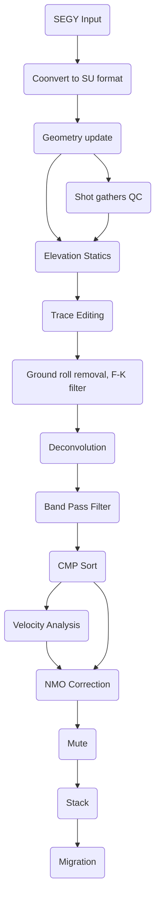

# Seismic-Processing-using-Madagascar
# Table of contents
* [Seismic processing of 2D line](#seismic-processing-of-2D-line)
  * [Reading and viewing seismic data](#reading-and-viewing-seismic-data)
  * [Setting geometry](#setting-geometry)
  * [Python code for geometry headers update](#python-code-for-geometry-headers-update)
  * [Viewing shot gathers QC](#viewing-shot-gathers-(QC))
  * [CMP locations QC and binning](#cmp-locations-qc-and-binning)
  * [Sort data to CMP](#sort-data-to-cmp)
  * [Gain testing](#gain-testing)
  * [NMO Correction and brute stack](#nmo-correction-and-brute-stack)
  * [Filtering in the (F-k) domain](#filtering-in-the-f-k-domain)
  * [Band Pass Filter testing](#band-pass-filter-testing)
  * [Deconvolution](#deconvolution)
  * [Velocity Analysis](#velocity-analysis)
 


## Seismic processing of 2D line
For this tutorial we are going to explain step by step on how to process 2D seismic data using Seismic Unix. The data for this document can be accessed for free [here!](https://dataunderground.org/dataset/poland-vibroseis/resource/96dfd0be-61c8-4edb-9d04-c7d2aeb16d27).
Below is the proposed processing flow chart that we will follow.


### Fetch the Seismic data

```Shell
tgz = '2D_Land_data_2ms.tgz'
Fetch(tgz,'freeusp')

files = ['Line_001.'+x for x in Split('TXT SPS RPS XPS sgy')]
Flow(files,tgz,
     'gunzip -c $SOURCE | tar -xvf -',stdin=0,stdout=-1)
```
### Convert sgy to rsf format

```Shell
Flow('line tline','Line_001.sgy','segyread tfile=${TARGETS[1]}')

```

Use **`sfheaderattr`** in terminal to check the header file:
```Shell
< tline.rsf sfheaderattr
```


#### Windowing and viewing data
As an example, the code below run a display in wiggles for one shot gather `shot gather FFID#231`. It is always a good idea to look at some small part of the data to check if data exists. 
Use **`sfwindow`** to check first 1000 traces:
```Shell
Flow('first','line','window n2=1000' )
Result('first',
       '''
       grey title="First 1000 traces"
       ''')
```
Use **`scons first.view`** to view first 1000 traces


#### Apply Automatic Gain control for better visualization
Use **`sfagc`** to apply agc to windowed traces. The smoothing is controlled by rect#= and repeat= parameters
```Shell

Flow('firstagc','first','agc rect1= 20 rect2=50')
Result('firstagc',
       '''
       grey title="First 1000 traces after Automatic Gain Control"
       ''')
```
Use **`scons firstagc.view`** to view first 1000 traces


### Setting geometry
The data we have: We've received seismic data along with four ASCII files:
Line_001.TXT: It contains information about the spacing between the source and receiver, numbering of shot points and receiver stations, reference velocity, reference level, and some other information.
Line_001.SPS: It contains information about the source, like its number, location, and elevation.
Line_001.RPS: It contains information about the receivers, like their number, location, and elevation.
Line_001.XPS: It contains information about the field record, like its number, which source it belongs to, the channels recorded, and the active receiver range.
Geometry definition is one of the most time consuming in processing especially for 2D data. This process is for converting the observed field parameters recorded in observer logs into trace headers.

 There are no zero coordinates, and all input records are accounted for.
I wrote the Python code below `sps_check.ipynb` to check the SPS information regarding, total number of shots, total number of receivers...etc.\
The program output the following information:

```sh
# for sx
cat Line_001.SPS | awk '{print $8}'

# for sy
cat Line_001.SPS | awk '{print $9}'

# for rx
cat Line_001.RPS | awk '{print $8}'

# for ry
cat Line_001.SRPS | awk '{print $9}'
```
I worked on another Python script which uses the SPS information as input and outputs a text file containig the geometry information (the X, Y coordinates for source and receiver, the offset, and the static information.

### Julia code to plot the source and treceiver coordinates
Below is the code to run in a Python environment.

```Julia
using Pkg
using CSV
using DataFrames
using Plots
s = CSV.read("source_coor.csv", DataFrame);
r = CSV.read("receiver_coor.csv", DataFrame);
sx = s.x
sy = s.y
rx = r.x
ry = r.y
plot(sx, sy, label = "Source", xaxis=" x coordinates", yaxis=" y coordinates", markershape=:x)
plot!(rx, ry, label = "Receiver", markershape=:x)

savefig("geometry.png")
```


### Update the headers to have sourece, receiver coordinates and offset
Use **`sfintbin`** to take input a 2-D trace file and trace headers to arrange input traces in a 3-D cube


```Shell
# Arrange receiver coordinates 
lines = {'S':251,'R':782}
shots = []
for shot in range(lines['S']):
    line = 'line%d' % shot
    Flow(line,'R','window f2=%d n2=282' % (2*shot))
    shots.append(line)
Flow('rece',shots,'cat axis=3 ${SOURCES[1:%d]}' % len(shots))
Flow('sour','S','spray axis=2 n=282 o=0 d=1')

# convert line in same dimension as sour and rece

Flow('line_0','line','intbin xk=cdpt yk=fldr | window f2=2' )
Flow('tline_0','tline','intbin xk=cdpt yk=fldr head=$SOURCE | window f2=2 ')

# Separate Sx, Sy, Rx, and Ry
Flow('sourx','sour','window n1=1 |  scale dscale=0.001')
Flow('soury','sour','window f1=1 |  scale dscale=0.001')
Flow('recex','rece','window n1=1 |  scale dscale=0.001')
Flow('recey','rece','window f1=1 |  scale dscale=0.001')

# Calculate the offset
Flow('offset','sourx soury recex recey',
     '''
     math SX=${SOURCES[0]} SY=${SOURCES[1]}
     RX=${SOURCES[2]} RY=${SOURCES[3]}
     output="sqrt((RX-SX)^2+(RY-SY)^2)"
     ''')

# change to integers to edit the headers
Flow('sx', 'sourx', 'dd type=int')
Flow('sy', 'soury', 'dd type=int')
Flow('rx', 'recex', 'dd type=int')
Flow('ry', 'recey', 'dd type=int')
Flow('o', 'offset', 'dd type=int')

Flow('header_new','line_0 tline_0 sx sy rx ry o',
     'segyheader tfile=${SOURCES[1]} sx=${SOURCES[2]} sy=${SOURCES[3]} gx=${SOURCES[4]} gy=${SOURCES[5]} offset=${SOURCES[6]}')
```
Use **`sfheaderattr`** in terminal to check the header file:


###  Visualize regular geometry
```Shell
Flow('lines','line_0','put label3=Source d3=0.05  o3=688  unit3=km  label2=Offset d2=0.025 o2=-3.5 unit2=km label1=Time unit1=s')
Result('lines',
       '''
       transp memsize=1000 plane=23 |
       byte gainpanel=each |
       grey3 frame1=500 frame2=100 frame3=120 flat=n movie=2
       title="Raw Data"
       ''')

```
Use **`lines.view`** to see the results


### First break mute

Use **`sfmutter`** to mute the background noise

```Shell
# Seperate shot 100
Flow('shot100','lines','window n3=1 f3=100')
Result('shot100',' agc rect1=50 rect2=20  | grey title="Shot 100"')

# Select muting parameter for background noise
Flow('mute100','shot100','mutter  slope0=0.2')
Plot('mute198','agc rect1=50 rect2=20 | grey title="Shot 198 after mute"')
```


If you are happy with the results, apply same mute parameters to all shots
```Shell
#Apply mute to all shots
Flow('mutes','lines','mutter slope0=0.2')
```
### Subsampling
Use **`sfspectra2`** to convert the data to f-k domain

# spectra for shot 100

```Shell
Flow('spec100','mute100','spectra2')
Plot('spec100',' grey color=j tile="spectra before subsampling"')
Result('spec100','mute100 spec100','SideBySideAniso')
```

The specta clearly shows the upper and lower frequency limits of the vibroseis sweep [8 - 95 Hz]. Carrying forth with 2 millisecond sampled data [Nyquist frequency 250 Hz] is clearly not required. We will resample to a 4 ms sample rate [Nyquist frquency of 125 Hz]. Since there are no frequencies above 95 Hz in this data we do not strictly need to first apply an anti-alias filter prior to resampling.

```Shell

#subsampling to 4ms
Flow('subsample100', 'mute100', 'bandpass flo=3 fhi=125| window j1=2')
Plot('subsample100','agc rect1=50 rect2=20 | grey title="Shot 100 after subsampling"')
Flow('subspectra100','subsample100','spectra2')
Plot('subspectra100','grey color=j title="Spectra after subsampling"')
Result('subspectra100','subsample100 subspectra100','SideBySideAniso')

# subsampling all shots to 4ms
Flow('subsample', 'mutes', 'bandpass flo=3 fhi=125| window j1=2')
```


### FK filter for Ground Roll attenuation
Use **`sffft1 and sffft3`* to convert the data to time frequency domain

# ltft for shot 100

```Shell
Flow('fk','subsample100','fft1 | fft3')
Result('fks','fk',
       '''
       real | 
       grey color=j 
       title="F-K spectra"
       ''')
```


In this case, just by looking the spectra it is difficult to tell which part is noise and which part is signal. Energy at the centre part of the spectra look denser, which is beleived to be ground roll. To mute that part, run-
```Shell

Flow('rmutter','fk','real | mutter slope0=3 ')
Flow('imutter','fk','imag | mutter slope0=3 ')
Plot('rfks','rmutter',
       '''
       grey color=j
       title="Muted F-K spectra"
       ''')
Flow('mutter','rmutter imutter','cmplx ${SOURCES[:2]}')
Flow('inoi','mutter',
     '''
     fft3 inv=y |
     fft1 inv=y |
     mutter slope0=3 inner=n
     ''')
Plot('inoi',' agc rect1=50 rect2=20  | grey title="Ground Roll"')  # noise
Result('inoi','rfks inoi','SideBySideAniso')
```


Subtract Ground roll from the signal
```Shell
Flow('isig','subsample100 inoi',
     '''
     add scale=1,-1 ${SOURCES[1]}
     ''')

Plot('isig','agc rect1=50 rect2=20  | grey title="After Ground Roll Attenuation"')

Result('fk_filter','subsample100 inoi ifk','SideBySideAniso')
```


### LTFT for better Ground Roll attenuation
Use **`sfltft`** to convert the data to local time frequency domain

# ltft for shot 100

```Shell
# CalculateTime-frequency using LTFT
Flow('ltft100','subsample100',
     '''
     ltft rect=20 verb=n nw=50 dw=2 niter=50
     ''')
Result('ltft100',
       '''
       math output="abs(input)" | real |
       byte allpos=y gainpanel=100 pclip=99 |
       grey3 color=j  frame1=120 frame2=7 frame3=71 label1=Time flat=n movie=2
       unit1=s label3=Offset label2="\F5 f \F-1" unit3=km
       ''')
```


Apply soft thresholding using **`sfthreshold2`** . Remove the low energy values and keep the higher energy one (assumed to be ground rolls)
```Shell

Flow('thr100','ltft100',
     '''
     transp plane=23 memsize=1000 |
     threshold2 pclip=25 verb=y |
     transp plane=23 memsize=1000
     ''')
Result('thr100',
       '''
       math output="abs(input)" | real |
       byte allpos=y gainpanel=100 pclip=99 |
       grey3 color=j  frame1=120 frame2=7 frame3=71 label1=Time flat=n 
       unit1=s label3=Offset label2="\F5 f \F-1" unit3=km
       screenht=10 screenratio=0.7 parallel2=n format2=%3.1f
       point1=0.8 point2=0.3 wanttitle=n labelfat=4 font=2 titlefat=4
       ''')
```


Apply inverse ltft by using parameter inv=y
```Shell
# # Denoise
Flow('noise100','thr100','ltft inv=y | mutter t0=-0.5 v0=0.7')
Plot('noise100',
     'agc rect1=50 rect2=20 | grey title="Ground-roll 100" unit2=km labelfat=4 titlefat=4')

Flow('signal100','subsample100 noise100','add scale=1,-1 ${SOURCES[1]}')
Plot('signal100',
     'agc rect1=50 rect2=20 | grey title="Ground-roll removal" labelfat=4 titlefat=4')
Result('sn100','mute100 signal100 noise100','SideBySideAniso')
```


Apply LTFT and thresholding to all the shots
```Shell

# apply ltft to all shots
Flow('ltft','subsample',
     '''
     ltft rect=20 verb=n nw=50 dw=2 niter=50
     ''')
```


Use **`sfmutter`** to mute the background noise

```Shell
# Seperate shot 100
Flow('shot100','lines','window n3=1 f3=100')
Result('shot100',' agc rect1=50 rect2=20  | grey title="Shot 100"')

# Select muting parameter for background noise
Flow('mute100','shot100','mutter  slope0=0.2')
Plot('mute198','agc rect1=50 rect2=20 | grey title="Shot 198 after mute"')
```


If you are happy with the results, apply same mute parameters to all shots
```Shell
#Apply mute to all shots
Flow('mutes','lines','mutter slope0=0.2')
```

### Map to regulat Geometry

Use **`sfintbin`** to take input a 2-D trace file and uses trace headers to arrange input traces in a 3-D cube

```Shell
Flow('lines','line',
     '''
     intbin xk=cdpt yk=fldr | window f2=2 |
     put
     label3=Source d3=0.05  o3=688  unit3=km
     label2=Offset d2=0.025 o2=-3.5 unit2=km
     label1=Time unit1=s
     ''')
```


Another QC we can look at the source and receiver locations, first thing to do is to create the binary files that contain the coordinates information (X and Y) for both source and receiver.

```Gawk
gawk '{print $1,$2}' < geometry.txt |sort|uniq|a2b > srcloc.bin
gawk '{print $5,$6}' < geometry.txt |sort|uniq|a2b > rcvloc.bin
```
Now we have the binary information of the source and receiver locations in those two files, we concatenate them and we plot data  using psgraph. The process is described in a bash script `04_geom_qc1.job`

```sh
#!/bin/bash

cat srcloc.bin rcvloc.bin |
	psgraph n=251,782 linecolor=red,blue wbox=16 hbox=3.5 \
	d1num=1000 d2num=1000 \
	labelsize=9 grid1=solid grid2=solid gridcolor=gray marksize=1,1 \
	gridwidth=0 linewidth=0,0 title="Source & Receiver Locations" \
	label1=Easting label2=Northing > SrcRcv_loc_map.ps
```
The generated post graph file .ps can be viewed using line command:

```sh
gv SrcRcv_loc_map.ps
```


### CMP locations QC and binning

It is well known that a straight 2D line, a CMP location is defined as the midpoint between the source and the receiver locations. On a crooked line (our case), CMPs may do not lie on the line of source and receiver.\
So, let’s plot the CMPs locations using same script as before. But this time calculating the midpoint locations of CMPs using the provided information in the geometry text file.

```gawk
#!/bin/bash

gawk '{print ($1+$5)/2,($2+$6)/2}'<myheaders_new.txt |a2b > cmploc.bin
	cat cmploc.bin srcloc.bin rcvloc.bin |
	psgraph n=70782,251,782 linecolor=green,red,blue wbox=16 hbox=3.5 \
	d1num=1000 d2num=1000 \
	labelsize=9 grid1=solid grid2=solid gridcolor=gray marksize=0.5,1,1 \
	gridwidth=0 linewidth=0,0 title="Source Receiver and CMPs locations"\
	label1=Easting label2=Northing > SrcRcvCmp_loc_map.ps
```
Let's plot via the command:
```sh
gv SrcRcvCmp_loc_map.ps
```


It is well noticed in the graph that we are dealing with a crooked line, CMPs are not falling between source and receiver, so a a possible solution to this is to do binning. let's tak teh receiver line, then we can project all actual CMP locations to the nearest point on the receiver line.\
In order to choose the best parameter for the maximum offset distance between a cmp location and the cmp line which is supposed to be the `receiver line`. After several tests as described int the shell script, the Maximum offline distance that we choose is 200m.

```sh
#!/bin/bash

# Set up a command to concatenate some plot files for comparing off-line distances accepted
convert="cat "

# Set the CMP interval
dcdp=12.5

# Loop through several offline distances and compare results.
for distmax in 12.5 25 50 100 200 500
do
	echo Running crooked line binning for maximimum offline distance $distmax into $dcdp m bins

	sucdpbin <data_geom2.su xline=684590.2,697315.1,703807.7 yline=3837867.6,3839748.8,3841277.2 verbose=2 dcdp=$dcdp distmax=$distmax 2>cdp.log |suwind key=cdp min=1 > geomdata_cmps_$distmax.su

	echo Creating chart data
	suchart < geomdata_cmps_$distmax.su key1=cdp key2=offset >plotdata outpar=par

	echo Running Postscript graphing routine
	psgraph <plotdata par=par linewidth=0 mark=0 marksize=1 labelsize=6 titlesize=12 linecolor=blue wbox=13 hbox=10 >plot$distmax.ps title="Maximum offline distance $distmax m  - $dcdp m Bins"

	convert="$convert plot$distmax.ps"
done

# Now concatenate the Postscript files in the same order they were created, so the resulting multipage file can be opened and the effects of changing the offline distance parameter
$convert > crookedLine_bining.ps
```
Let's plot the stacking chart, which is a plot of the header CDP field versus the offset field. We can notice the white stripes indicating missing shots.

```sh
gv crookedLine_bining.ps
```


### Sort data to CMP
To sort the data from shot to cmp domain we use `susort`:
```sh
susort cdp offset < data.su
```
### Gain testing
```sh
#!/bin/sh

suwind < data_geom2.su key=ep min=32 max=32 > data_geom_ep32.su

suxwigb < data_geom_ep32.su title="Ungained Data" &
sugain < data_geom_ep32.su scale=5.0 | suxwigb title="Scaled data" &
sugain < data_geom_ep32.su agc=1 wagc=.01 | suxwigb title="AGC=1 WAGC=.01 sec &
sugain < data_geom_ep32.su agc=1 wagc=.2 | suxwigb title="AGC=1 WAGC=.2 sec &
sugain < data_geom_ep32.su pbal=1 | suxwigb title="traces balanced by rms" &
sugain < data_geom_ep32.su qbal=1 | suxwigb title="traces balanced by quantile" &
sugain < data_geom_ep32.su mbal=1 | suxwigb title="traces balanced by mean" &
sugain < data_geom_ep32.su tpow=2 | suxwigb title="t squared factor applied" &
sugain < data_geom_ep32.su tpow=.5 | suxwigb title="square root t factor applied" &
```


### NMO Correction and brute stack
As a preliminary step, we can run the brute stack flow in this stage as a QC and in order to compare with further stacks as we move forward in our processing.
the stack has an AGC applied.
```sh
sunmo < data.cdp vnmo=1700,2750,3000 tnmo=0.1,1.0,2.0 \
	| sugain \
	    agc=1 \
	    wagc=.2 \
	| sustack > stack.su
suximage < stack.su cmp=hsv5 title="Brute stack V0" perc=90 &
```


### Filtering in the (F-k) domain
To attenuate the coherent noise such as ground roll, we used (f, k) filetering as a first step as it targets the linear noise taking into consideration the slope or the dip of the event.\
For this purpose I did numerous tests on one shot gather. Once you are satisfied with the result, you can run the (f;k) filter on the whole data as showed in the script below.\
```sh
#!/bin/bash

indata=geomdata_bin200_d2.su

sudipfilt < $indata dt=0.002 dx=0.025\
	slopes=-0.5,-0.3,0.3,0.5 amps=0,1,1,0 bias=0 > geomdata_bin200_fk.su
```
With: 
 - amps=1,1,1,1 (do nothing)
 - amps=1,0,0,1 (The reject zone)
 - amps=0,1,1,0 (The pass zone)

The images below shows the shots before, after and the rejected data, respectively with their corresponding (f,k) spectrums.


### Band Pass Filter testing
before proceeding to BPF, it is important to know the frequency content of our data byt transfromfing our data from (x,t) domain to (x,f) domain, where Frequency is on the vertical scale, and trace number is on the horizontal.
```sh
suspecfx < stk_fk.su | suximage key=cdp title="F-X SPECTRUM" label2="CMP" label1="Frequency (Hz)" cmap="hsv2" bclip=45
```


Zooming in our data, we can notice that the energy is mainly concentrated is the frequency band between 15 and 45 Hz.\

For the BPF testing, I did several Band Pass Filter panels, below is the result of one test using a combination of frequencies from, 10,15,55,60. The spectrum is obtained after transforming the prestack data from time domain to frequency domain using Gabor Transform.

The [Gabor transform](https://en.wikipedia.org/wiki/Gabor_transform), as explained in wikipidia is named after Dennis Gabor, is a special case of the short-time Fourier transform. It is used to determine the sinusoidal frequency and phase content of local sections of a signal as it changes over time. 


Compare the two frequency spectrums. Notice how the sub-20Hz sections is subdued by the filter applied.
Now we apply the BPF to all the data via the command:
```sh
sufilter < geomshots_bin200_fk.su f=10,15,55,60 > geomshots_bin200_fk_bpf.su
```
In order to QC the output before and after the BPF, let’s check the stacks before and after. Notice, there is a better continuity in the shallow part of the stack.


### Deconvolution
Deconvolution in an inverse process which consists of removing the effect of the waveform. Basically we  process of removing the
effect of a waveform, to produce a desired output. In practice the objectif is to achieve a better estimate of the gelogical layers in term of increasing the temporal resolution of the reflector.\
Before proceeding to deconvolution, first we need to perfoem the autocorrelation to have a better estimate of the deconvolution parameters and undestanding the the multiple energy behavior.


The code below is the code to perform the autocorrelation and deconvolution test. The main parameters that we should pay attention to are minlag and maxlag, while ntout is the number of autocorrelation samples that will be produced. You can test with different pnoise.


```sh
#!/bin/sh

minlag=0.02
maxlag=0.1
pnoise=0.001
ntout=120
indata=geomdata_bin200_fk_bpf.su

rm -f tmp*

# Data selection you will probably need to use sugain to remove any decay in amplitudes with time that may result from geometric spreading
suwind < $indata key=ep min=120 max=120 > tmp0
sugain < tmp0 agc=1 wagc=0.2 > tmp1

# One Shot display
suximage < tmp1 perc=90 title="Before deconvolution" \
                        label1="Time(s)" \
                        lebel2="Trace" &

# Autocorrelation before deconvolution
suacor < tmp1 suacor ntout=$ntout | suximage perc=90 title="Autocorrelation before deconvolution" \
                        label1="Time(s)" \
                        lebel2="Trace" &

# Deconvolution
supef < tmp1 > tmp2 minlag=$minlag maxlag=$maxlag pnoise=$pnoise 

# After Deconvolution

suximage < tmp2 perc=90 title="After deconvolution" \
                        label1="Time(s)" \
                        lebel2="Trace" &

# Autocorrelation after deconvolution
suacor < tmp2 suacor ntout=$ntout | suximage perc=90 title="Autocorrelation after deconvolution" \
                        label1="Time(s)" \
                        lebel2="Trace" &

# Apply deconvolution to al the data
supef < geomdata_bin200_fk_bpf.su > geomdata_bin200_fk_bpf_decon.su minlag=0.02 maxlag=0.1 pnoise=0.001 

rm -f tmp*
```


### Velocity Analysis
A script made by John W. Stockwell; [iva.sh](https://github.com/hadi-tim/sdp-seismic-unix/blob/main/script/iva.sh) a Copyright (c) Colorado School of Mines. This script provide an interactive velocity picking session. It will first ask the user to input number of picks. You are then asked to state the CMP number for the first pick, then it will diplay three plots:
* Semblance plot of the selected CMP number
* Plot of the selected CMP gather
* Constant Velocity Stack of the selected CMP number


The two displays below show CMP#1900 after NMO correction and the corresponding stacking velocity profile.


The first pass of velocity picking showed a good stack result. The pictures below is a comparison between the previous stack after deconvolution and the stack after deconvolution but using the first pass of picked velocities.


</details>

<!--
  <<< Author notes: Footer >>>
  Add a link to get support, GitHub status page, code of conduct, license link.
-->

---

Get help: [Post in our discussion board](https://github.com/skills/.github/discussions) &bull; [Review the GitHub status page](https://www.githubstatus.com/)

&copy; 2022 GitHub &bull; [Code of Conduct](https://www.contributor-covenant.org/version/2/1/code_of_conduct/code_of_conduct.md) &bull; [CC-BY-4.0 License](https://creativecommons.org/licenses/by/4.0/legalcode)
