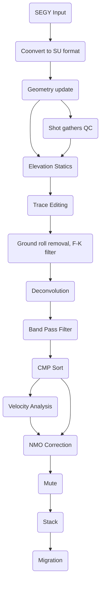

# Seismic-Processing-using-Madagascar
# Table of contents
* [Seismic processing of 2D line](#seismic-processing-of-2D-line)
  * [Reading and viewing seismic data](#reading-and-viewing-seismic-data)
  * [Setting geometry](#setting-geometry)
  * [Python code for geometry headers update](#python-code-for-geometry-headers-update)
  * [Viewing shot gathers QC](#viewing-shot-gathers-(QC))
  * [CMP locations QC and binning](#cmp-locations-qc-and-binning)
  * [Sort data to CMP](#sort-data-to-cmp)
  * [Gain testing](#gain-testing)
  * [NMO Correction and brute stack](#nmo-correction-and-brute-stack)
  * [Filtering in the (F-k) domain](#filtering-in-the-f-k-domain)
  * [Band Pass Filter testing](#band-pass-filter-testing)
  * [Deconvolution](#deconvolution)
  * [Velocity Analysis](#velocity-analysis)
 


## Seismic processing of 2D line
For this tutorial we are going to explain step by step on how to process 2D seismic data using Seismic Unix. The data for this document can be accessed for free [here!](https://dataunderground.org/dataset/poland-vibroseis/resource/96dfd0be-61c8-4edb-9d04-c7d2aeb16d27).
Below is the proposed processing flow chart that we will follow.


### Fetch the Seismic data

```Shell
tgz = '2D_Land_data_2ms.tgz'
Fetch(tgz,'freeusp')

files = ['Line_001.'+x for x in Split('TXT SPS RPS XPS sgy')]
Flow(files,tgz,
     'gunzip -c $SOURCE | tar -xvf -',stdin=0,stdout=-1)
```
### Convert sgy to rsf format

```Shell
Flow('line tline','Line_001.sgy','segyread tfile=${TARGETS[1]}')

```

Use **`sfheaderattr`** in terminal to check the header file:
```Shell
< tline.rsf sfheaderattr
```


#### Windowing and viewing data
As an example, the code below run a display in wiggles for one shot gather `shot gather FFID#231`. It is always a good idea to look at some small part of the data to check if data exists. 
Use **`sfwindow`** to check first 1000 traces:
```Shell
Flow('first','line','window n2=1000' )
Result('first',
       '''
       grey title="First 1000 traces"
       ''')
```
Use **`scons first.view`** to view first 1000 traces


#### Apply Automatic Gain control for better visualization
Use **`sfagc`** to apply agc to windowed traces. The smoothing is controlled by rect#= and repeat= parameters
```Shell

Flow('firstagc','first','agc rect1= 20 rect2=50')
Result('firstagc',
       '''
       grey title="First 1000 traces after Automatic Gain Control"
       ''')
```
Use **`scons firstagc.view`** to view first 1000 traces


### Setting geometry
The data we have: We've received seismic data along with four ASCII files:
Line_001.TXT: It contains information about the spacing between the source and receiver, numbering of shot points and receiver stations, reference velocity, reference level, and some other information.
Line_001.SPS: It contains information about the source, like its number, location, and elevation.
Line_001.RPS: It contains information about the receivers, like their number, location, and elevation.
Line_001.XPS: It contains information about the field record, like its number, which source it belongs to, the channels recorded, and the active receiver range.
Geometry definition is one of the most time consuming in processing especially for 2D data. This process is for converting the observed field parameters recorded in observer logs into trace headers.

 There are no zero coordinates, and all input records are accounted for.
I wrote the Python code below `sps_check.ipynb` to check the SPS information regarding, total number of shots, total number of receivers...etc.\
The program output the following information:

```sh
# for sx
cat Line_001.SPS | awk '{print $8}'

# for sy
cat Line_001.SPS | awk '{print $9}'

# for rx
cat Line_001.RPS | awk '{print $8}'

# for ry
cat Line_001.SRPS | awk '{print $9}'
```
I worked on another Python script which uses the SPS information as input and outputs a text file containig the geometry information (the X, Y coordinates for source and receiver, the offset, and the static information.

### Julia code to plot the source and treceiver coordinates
Below is the code to run in a Python environment.

```Julia
using Pkg
using CSV
using DataFrames
using Plots
s = CSV.read("source_coor.csv", DataFrame);
r = CSV.read("receiver_coor.csv", DataFrame);
sx = s.x
sy = s.y
rx = r.x
ry = r.y
plot(sx, sy, label = "Source", xaxis=" x coordinates", yaxis=" y coordinates", markershape=:x)
plot!(rx, ry, label = "Receiver", markershape=:x)

savefig("geometry.png")
```


### Update the headers to have sourece, receiver coordinates and offset
Use **`sfintbin`** to take input a 2-D trace file and trace headers to arrange input traces in a 3-D cube


```Shell
# Arrange receiver coordinates 
lines = {'S':251,'R':782}
shots = []
for shot in range(lines['S']):
    line = 'line%d' % shot
    Flow(line,'R','window f2=%d n2=282' % (2*shot))
    shots.append(line)
Flow('rece',shots,'cat axis=3 ${SOURCES[1:%d]}' % len(shots))
Flow('sour','S','spray axis=2 n=282 o=0 d=1')

# convert line in same dimension as sour and rece

Flow('line_0','line','intbin xk=cdpt yk=fldr | window f2=2' )
Flow('tline_0','tline','intbin xk=cdpt yk=fldr head=$SOURCE | window f2=2 ')

# Separate Sx, Sy, Rx, and Ry
Flow('sourx','sour','window n1=1 |  scale dscale=0.001')
Flow('soury','sour','window f1=1 |  scale dscale=0.001')
Flow('recex','rece','window n1=1 |  scale dscale=0.001')
Flow('recey','rece','window f1=1 |  scale dscale=0.001')

# Calculate the offset
Flow('offset','sourx soury recex recey',
     '''
     math SX=${SOURCES[0]} SY=${SOURCES[1]}
     RX=${SOURCES[2]} RY=${SOURCES[3]}
     output="sqrt((RX-SX)^2+(RY-SY)^2)"
     ''')

# change to integers to edit the headers
Flow('sx', 'sourx', 'dd type=int')
Flow('sy', 'soury', 'dd type=int')
Flow('rx', 'recex', 'dd type=int')
Flow('ry', 'recey', 'dd type=int')
Flow('o', 'offset', 'dd type=int')

Flow('header_new','line_0 tline_0 sx sy rx ry o',
     'segyheader tfile=${SOURCES[1]} sx=${SOURCES[2]} sy=${SOURCES[3]} gx=${SOURCES[4]} gy=${SOURCES[5]} offset=${SOURCES[6]}')
```
Use **`sfheaderattr`** in terminal to check the header file:


###  Visualize regular geometry
```Shell
Flow('lines','line_0','put label3=Source d3=0.05  o3=688  unit3=km  label2=Offset d2=0.025 o2=-3.5 unit2=km label1=Time unit1=s')
Result('lines',
       '''
       transp memsize=1000 plane=23 |
       byte gainpanel=each |
       grey3 frame1=500 frame2=100 frame3=120 flat=n movie=2
       title="Raw Data"
       ''')

```
Use **`lines.view`** to see the results


### First break mute

Use **`sfmutter`** to mute the background noise

```Shell
# Seperate shot 100
Flow('shot100','lines','window n3=1 f3=100')
Result('shot100',' agc rect1=50 rect2=20  | grey title="Shot 100"')

# Select muting parameter for background noise
Flow('mute100','shot100','mutter  slope0=0.2')
Plot('mute198','agc rect1=50 rect2=20 | grey title="Shot 198 after mute"')
```


If you are happy with the results, apply same mute parameters to all shots
```Shell
#Apply mute to all shots
Flow('mutes','lines','mutter slope0=0.2')
```
### Subsampling
Use **`sfspectra2`** to convert the data to f-k domain

# spectra for shot 100

```Shell
Flow('spec100','mute100','spectra2')
Plot('spec100',' grey color=j tile="spectra before subsampling"')
Result('spec100','mute100 spec100','SideBySideAniso')
```

The specta clearly shows the upper and lower frequency limits of the vibroseis sweep [8 - 95 Hz]. Carrying forth with 2 millisecond sampled data [Nyquist frequency 250 Hz] is clearly not required. We will resample to a 4 ms sample rate [Nyquist frquency of 125 Hz]. Since there are no frequencies above 95 Hz in this data we do not strictly need to first apply an anti-alias filter prior to resampling.

```Shell

#subsampling to 4ms
Flow('subsample100', 'mute100', 'bandpass flo=3 fhi=125| window j1=2')
Plot('subsample100','agc rect1=50 rect2=20 | grey title="Shot 100 after subsampling"')
Flow('subspectra100','subsample100','spectra2')
Plot('subspectra100','grey color=j title="Spectra after subsampling"')
Result('subspectra100','subsample100 subspectra100','SideBySideAniso')

# subsampling all shots to 4ms
Flow('subsample', 'mutes', 'bandpass flo=3 fhi=125| window j1=2')
```


### FK filter for Ground Roll attenuation
Use **`sffft1 and sffft3`* to convert the data to time frequency domain

```Shell
Flow('fk','subsample100','fft1 | fft3')
Result('fks','fk',
       '''
       real | 
       grey color=j 
       title="F-K spectra"
       ''')
```


In this case, just by looking the spectra it is difficult to tell which part is noise and which part is signal. Energy at the centre part of the spectra look denser, which is beleived to be ground roll. To mute that part, run-
```Shell

Flow('rmutter','fk','real | mutter slope0=3 ')
Flow('imutter','fk','imag | mutter slope0=3 ')
Plot('rfks','rmutter',
       '''
       grey color=j
       title="Muted F-K spectra"
       ''')
Flow('mutter','rmutter imutter','cmplx ${SOURCES[:2]}')
Flow('inoi','mutter',
     '''
     fft3 inv=y |
     fft1 inv=y |
     mutter slope0=3 inner=n
     ''')
Plot('inoi',' agc rect1=50 rect2=20  | grey title="Ground Roll"')  # noise
Result('inoi','rfks inoi','SideBySideAniso')
```


Subtract Ground roll from the signal
```Shell
Flow('isig','subsample100 inoi',
     '''
     add scale=1,-1 ${SOURCES[1]}
     ''')

Plot('isig','agc rect1=50 rect2=20  | grey title="After Ground Roll Attenuation"')

Result('fk_filter','subsample100 inoi ifk','SideBySideAniso')
```


### LTFT for better Ground Roll attenuation
Use **`sfltft`** to convert the data to local time frequency domain

# ltft for shot 100

```Shell
# CalculateTime-frequency using LTFT
Flow('ltft100','subsample100',
     '''
     ltft rect=20 verb=n nw=50 dw=2 niter=50
     ''')
Result('ltft100',
       '''
       math output="abs(input)" | real |
       byte allpos=y gainpanel=100 pclip=99 |
       grey3 color=j  frame1=120 frame2=7 frame3=71 label1=Time flat=n movie=2
       unit1=s label3=Offset label2="\F5 f \F-1" unit3=km
       ''')
```


Apply soft thresholding using **`sfthreshold2`** . Remove the low energy values and keep the higher energy one (assumed to be ground rolls)
```Shell

Flow('thr100','ltft100',
     '''
     transp plane=23 memsize=1000 |
     threshold2 pclip=25 verb=y |
     transp plane=23 memsize=1000
     ''')
Result('thr100',
       '''
       math output="abs(input)" | real |
       byte allpos=y gainpanel=100 pclip=99 |
       grey3 color=j  frame1=120 frame2=7 frame3=71 label1=Time flat=n 
       unit1=s label3=Offset label2="\F5 f \F-1" unit3=km
       screenht=10 screenratio=0.7 parallel2=n format2=%3.1f
       point1=0.8 point2=0.3 wanttitle=n labelfat=4 font=2 titlefat=4
       ''')
```


Apply inverse ltft by using parameter inv=y
```Shell
# # Denoise
Flow('noise100','thr100','ltft inv=y | mutter t0=-0.5 v0=0.7')
Plot('noise100',
     'agc rect1=50 rect2=20 | grey title="Ground-roll 100" unit2=km labelfat=4 titlefat=4')

Flow('signal100','subsample100 noise100','add scale=1,-1 ${SOURCES[1]}')
Plot('signal100',
     'agc rect1=50 rect2=20 | grey title="Ground-roll removal" labelfat=4 titlefat=4')
Result('sn100','mute100 signal100 noise100','SideBySideAniso')
```


Apply LTFT and thresholding to all the shots
```Shell

# apply ltft to all shots
Flow('ltft','subsample',
     '''
     ltft rect=20 verb=n nw=50 dw=2 niter=50
     ''')
```

### Convert Shots to CMPs

Use **`sfshot2cmp`** to convert shot gathers to smp gathers

```Shell
Flow('cmps','signal',
     '''
     mutter v0=3. |
     shot2cmp half=n | put o2=-1.75 d2=0.05 label2="Half-offset"
     ''')

Result('cmps',
       '''
       byte gainpanel=each | window j3=2 |
       grey3 frame1=500 frame2=36 frame3=321 flat=n
       title="CMP gathers" point1=0.7 label2=Offset label3=Midpoint
       ''')
```


Extract CMP 300 for velocity analysis

```Shell

Flow('cmp1','cmps','window n3=1 f3=300')
Plot('cmp1',' agc rect1=50 rect2=20  | grey title="CMP 300"')
Result('cmp1',' agc rect1=50 rect2=20  | grey title="CMP 300"')
```


### Velocity Scan and NMO

Use **`sfvscan`** to get seismic velocity analysis by scanning stacking velocities
Use **`sfpick`** for automated picking. Also, here I have used mute.c program to improve the picking process.

```Shell
# Velocity scan

Flow('vscan1','cmp1',
     '''
    vscan semblance=y v0=1.0 nv=75 dv=0.05 half=y
     ''')
Plot('vscan1',
     '''
     grey color=j allpos=y title="Semblance Scan" unit2=km/s
     ''')

mute = Program('mute.c')

Flow('vmute1','vscan1 %s' % mute[0],
     './${SOURCES[1]} t1=0.5 v1=4')

Plot('vmute1',
     '''
     grey color=j allpos=y title="Semblance Scan" unit2=km/s
     ''')

# # Automatic pick

Flow('vpick1','vmute1','pick rect1=10 rect2=20 gate=50 an=10')
Plot('vpick1',
     '''
     graph yreverse=y transp=y plotcol=7 plotfat=7 
     pad=n min2=1.4 max2=3.8 wantaxis=n wanttitle=n
     ''')

Plot('vscan2','vmute1 vpick1','Overlay')

# # NMO

Flow('nmo1','cmp1 vpick1',
     'nmo half=y  velocity=${SOURCES[1]}')
Plot('nmo1','agc rect1=50 rect2=20  | grey title="NMO CMP 300"')
Result('nmo1','agc rect1=50 rect2=20  | grey title="NMO CMP 300"')


Result('nmo1plot','cmp1 vscan2 nmo1','SideBySideAniso')

```


Apply NMO correction to all CMPs

```Shell

# NMO on all CMPS
v0 = 1.0
dv = 0.05
nv = 75

# Velocity scanning for all CMP gathers
Flow('scn','cmps',
     '''
     vscan semblance=y v0=%g nv=%d dv=%g half=y str=0 |
     mutter v0=0.9 t0=-4.5 inner=y
     ''' % (v0,nv,dv),split=[3,1285])

Flow('mute','scn %s' % mute[0],
     './${SOURCES[1]} t1=0.5 v1=4')

Flow('vel','mute','pick rect1=10 rect2=20 gate=50 an=10 | window')
Result('vel',
       '''
       grey title="NMO Velocity" label1="Time" label2="Lateral"
       color=j scalebar=y allpos=y bias=2.1 barlabel="Velocity"
       barreverse=y o2num=1 d2num=1 n2tic=3 labelfat=4 font=2 titlefat=4
       ''')
```


```Shell

# NMO
Flow('nmo','cmps vel',
     '''
     nmo velocity=${SOURCES[1]} half=y
     ''')

Result('nmo',
       '''
       byte gainpanel=each | 
       grey3 frame1=500 frame2=36 frame3=642 flat=n
       title="NMOed Data" point1=0.7
       label2=Offset label3=Midpoint
       ''')

```


### Time varying Median filter

Use **`sftvmf`** to apply the filter attenuating prestack random, spike-like noise.
I applied this on prestack nmo corrected CMP gathers.

```Shell
Flow('median','nmo','tvmf nfw=11 | bandpass flo=5 | bandpass fhi=95')

```

### stack

Use **`sfstack`** to stack
```Shell
Flow('median','nmo','tvmf nfw=11 | bandpass flo=5 | bandpass fhi=95')

```
I am showing results of stack before after apply median filter


</details>

<!--
  <<< Author notes: Footer >>>
  Add a link to get support, GitHub status page, code of conduct, license link.
-->

---

Get help: [Post in our discussion board](https://github.com/skills/.github/discussions) &bull; [Review the GitHub status page](https://www.githubstatus.com/)

&copy; 2022 GitHub &bull; [Code of Conduct](https://www.contributor-covenant.org/version/2/1/code_of_conduct/code_of_conduct.md) &bull; [CC-BY-4.0 License](https://creativecommons.org/licenses/by/4.0/legalcode)
