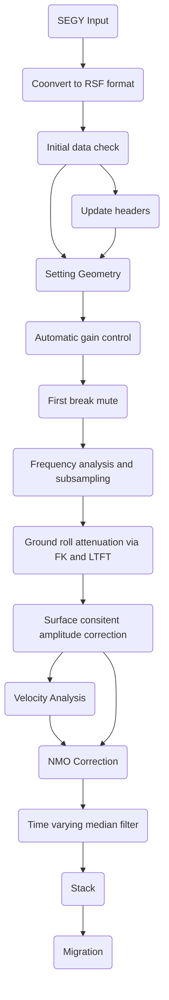

# Seismic-Processing-using-Madagascar
# Table of contents
* [Seismic processing of 2D line](#seismic-processing-of-2D-line)
  * [Fetching and reading seismic data](#Fetch-the-seismic-data)
  * [Setting geometry](#setting-geometry)
  * [Update the headers](#Update-the-headers-to-have-source-receiver-coordinats-and-offset)
  * [Viewing shot gather](#Visualize-regular-geometry)
  * [First break mute](#First-break-mute)
  * [Subsampling the data](#Subsampling)
  * [Ground roll attenuation](#FK-filter-for-Ground-Roll-attenuation)
  * [Surface consistent amplitude correction](#Surface-Consistent-Amplitude-Corrections)
  * [Sort to CMPs](#Convert-Shots-to-CMPs)
  * [Velocity analysis and NMO](#Velocity-Scan-and-NMO)
  * [Time varying median filter](#Time-varying-Median-filter)
  * [Stack](#Stack)
  * [Stolt's Migration](#Kirchoff-post-stack-time-migration)
 


## Seismic processing of 2D line
We processed 2D seismic data using Madagascar. Below is the proposed processing flow chart that we will follow.


### Fetch the Seismic data

We used a land vibroseis dataset. The data for this document can be accessed for free [here!](https://wiki.seg.org/wiki/2D_Vibroseis_Line_001).

```Shell
tgz = '2D_Land_data_2ms.tgz'
Fetch(tgz,'freeusp')

files = ['Line_001.'+x for x in Split('TXT SPS RPS XPS sgy')]
Flow(files,tgz,
     'gunzip -c $SOURCE | tar -xvf -',stdin=0,stdout=-1)
```
### Convert sgy to rsf format
**`sfsegyread`** to read the sgy file.
```Shell
Flow('line tline','Line_001.sgy','segyread tfile=${TARGETS[1]}')

```
**`sfheaderattr`** to check the header file:
```Shell
< tline.rsf sfheaderattr
```


#### Windowing and viewing data
**`sfwindow`** to check first 1000 traces.  It is always a good idea to look at some small part of the data to check if data exists. 

```Shell
Flow('first','line','window n2=1000' )
Result('first',
       '''
       grey title="First 1000 traces"
       ''')
```
**`scons first.view`** to view first 1000 traces


#### Apply Automatic Gain control for better visualization
 **`sfagc`** to apply agc to windowed traces. The smoothing is controlled by rect#= and repeat= parameters
```Shell

Flow('firstagc','first','agc rect1= 20 rect2=50')
Result('firstagc',
       '''
       grey title="First 1000 traces after Automatic Gain Control"
       ''')
```


### Setting geometry
We received seismic data along with four ASCII files:
Line_001.TXT: It contains information about the spacing between the source and receiver, numbering of shot points and receiver stations, reference velocity, reference level, and some other information.
Line_001.SPS: It contains information about the source, like its number, location, and elevation.
Line_001.RPS: It contains information about the receivers, like their number, location, and elevation.
Line_001.XPS: It contains information about the field record, like its number, which source it belongs to, the channels recorded, and the active receiver range.

There are no zero coordinates, and all input records are accounted for. A handy way to QC the source and receiver data is to plot the locations. We used awk to gather up the X,Y coordinate information from each of Line_001.SPS and Line_001.RPS. We separated the source and receiver coordinates and created csv file to read and plot the geometry in Julia.

```sh
# for sx
cat Line_001.SPS | awk '{print $8}'

# for sy
cat Line_001.SPS | awk '{print $9}'

# for rx
cat Line_001.RPS | awk '{print $8}'

# for ry
cat Line_001.SRPS | awk '{print $9}'
```

### Julia code to plot the source and treceiver coordinates
Below is the code to run in a Julia environment.

```Julia
using Pkg
using CSV
using DataFrames
using Plots
s = CSV.read("source_coor.csv", DataFrame);
r = CSV.read("receiver_coor.csv", DataFrame);
sx = s.x
sy = s.y
rx = r.x
ry = r.y
plot(sx, sy, label = "Source", xaxis=" x coordinates", yaxis=" y coordinates", markershape=:x)
plot!(rx, ry, label = "Receiver", markershape=:x)

savefig("geometry.png")
```


### Update the headers to have source, receiver coordinates and offset
Since, source, receiver , and offset coordinates are not in the header files, we edited the headers.

Line_001.SPS file has the Field Shot Point Number. The field shot point numbering covers the range from 701 to 1201 with an increment of 2 so that we have only odd field shot point numbers.
Line_001.RPS file has the Field Group Number. Field group numbering in this survey completely cover the range 561 through 1342 with an increment of 1. Total number of source coordinates are 251 in Line_001.SPS file and total number of receiver coordinates are 782. We have in total, 251 sequential shots. Each shot record was recorded by 282 sequential receiver groups.

```Shell
# Arrange receiver coordinates 
lines = {'S':251,'R':782}
shots = []
for shot in range(lines['S']):
    line = 'line%d' % shot
    Flow(line,'R','window f2=%d n2=282' % (2*shot))
    shots.append(line)
Flow('rece',shots,'cat axis=3 ${SOURCES[1:%d]}' % len(shots))
Flow('sour','S','spray axis=2 n=282 o=0 d=1')

# convert line in same dimension as sour and rece

Flow('line_0','line','intbin xk=cdpt yk=fldr | window f2=2' )
Flow('tline_0','tline','intbin xk=cdpt yk=fldr head=$SOURCE | window f2=2 ')

# Separate Sx, Sy, Rx, and Ry
Flow('sourx','sour','window n1=1 |  scale dscale=0.001')
Flow('soury','sour','window f1=1 |  scale dscale=0.001')
Flow('recex','rece','window n1=1 |  scale dscale=0.001')
Flow('recey','rece','window f1=1 |  scale dscale=0.001')

# Calculate the offset
Flow('offset','sourx soury recex recey',
     '''
     math SX=${SOURCES[0]} SY=${SOURCES[1]}
     RX=${SOURCES[2]} RY=${SOURCES[3]}
     output="sqrt((RX-SX)^2+(RY-SY)^2)"
     ''')

# change to integers to edit the headers
Flow('sx', 'sourx', 'dd type=int')
Flow('sy', 'soury', 'dd type=int')
Flow('rx', 'recex', 'dd type=int')
Flow('ry', 'recey', 'dd type=int')
Flow('o', 'offset', 'dd type=int')

Flow('header_new','line_0 tline_0 sx sy rx ry o',
     'segyheader tfile=${SOURCES[1]} sx=${SOURCES[2]} sy=${SOURCES[3]} gx=${SOURCES[4]} gy=${SOURCES[5]} offset=${SOURCES[6]}')
```
**`sfheaderattr`** to check the header file:


###  Visualize regular geometry

**`sfintbin`** to take input a 2-D trace file and trace headers to arrange input traces in a 3-D cube

```Shell
Flow('lines','line_0','put label3=Source d3=0.05  o3=688  unit3=km  label2=Offset d2=0.025 o2=-3.5 unit2=km label1=Time unit1=s')
Result('lines',
       '''
       transp memsize=1000 plane=23 |
       byte gainpanel=each |
       grey3 frame1=500 frame2=100 frame3=120 flat=n movie=2
       title="Raw Data"
       ''')

```


### Raw Stack

We converted the shot gathers to CMPs and stacked them before applying any processing steps to understand the initial noise in the data.

```Shell
Flow('rcmps','lines',
     '''
     shot2cmp half=n |
     put o2=-1.75 d2=0.05 label2="Half-offset"
     ''')
Flow('rstack','rcmps','stack')
Result('rstack',' rstack',
       '''
       grey title="Raw Stack"
       ''')

```


### First break mute

For simplicity, we extracted shot 100 for initial analysis and for decing the parameters before applying it to complete data.

**`sfwindow`** to separate shot 100 and **`sfmutter`** to mute the background noise

```Shell
# Seperate shot 100
Flow('shot100','lines','window n3=1 f3=100')
Result('shot100',' agc rect1=50 rect2=20  | grey title="Shot 100"')

# Select muting parameter for background noise
Flow('mute100','shot100','mutter  slope0=0.2')
Plot('mute198','agc rect1=50 rect2=20 | grey title="Shot 198 after mute"')
```


Deciding slope as 0.2, we applied the same mute parameters to all shots
```Shell
#Apply mute to all shots
Flow('mutes','lines','mutter slope0=0.2')
```

### Subsampling
**`sfspectra2`** to convert the data to f-k domain

# spectra for shot 100

```Shell
Flow('spec100','mute100','spectra2')
Plot('spec100',' grey color=j tile="spectra before subsampling"')
Result('spec100','mute100 spec100','SideBySideAniso')
```

The spectra clearly shows the upper and lower frequency limits of the vibroseis sweep [8 - 95 Hz]. Carrying forth with 2 millisecond sampled data [Nyquist frequency 250 Hz] is clearly not required. We will resample to a 4 ms sample rate [Nyquist frquency of 125 Hz]. Since there are no frequencies above 95 Hz in this data we do not strictly need to first apply an anti-alias filter prior to resampling.

```Shell

#subsampling to 4ms
Flow('subsample100', 'mute100', 'bandpass flo=3 fhi=125| window j1=2')
Plot('subsample100','agc rect1=50 rect2=20 | grey title="Shot 100 after subsampling"')
Flow('subspectra100','subsample100','spectra2')
Plot('subspectra100','grey color=j title="Spectra after subsampling"')
Result('subspectra100','subsample100 subspectra100','SideBySideAniso')

# subsampling all shots to 4ms
Flow('subsample', 'mutes', 'bandpass flo=3 fhi=125| window j1=2')
```


### FK filter for Ground Roll attenuation
**`sffft1 and sffft3`* to convert the data to time frequency domain

```Shell
Flow('fk','subsample100','fft1 | fft3')
Result('fks','fk',
       '''
       real | 
       grey color=j 
       title="F-K spectra"
       ''')
```


In this case, just by looking the spectra it is difficult to tell which part is noise and which part is signal. Energy at the centre part of the spectra looks denser, which is beleived to be ground roll. We muted that region.-
```Shell

Flow('rmutter','fk','real | mutter slope0=3 ')
Flow('imutter','fk','imag | mutter slope0=3 ')
Plot('rfks','rmutter',
       '''
       grey color=j
       title="Muted F-K spectra"
       ''')
Flow('mutter','rmutter imutter','cmplx ${SOURCES[:2]}')
Flow('inoi','mutter',
     '''
     fft3 inv=y |
     fft1 inv=y |
     mutter slope0=3 inner=n
     ''')
Plot('inoi',' agc rect1=50 rect2=20  | grey title="Ground Roll"')  # noise
Result('inoi','rfks inoi','SideBySideAniso')
```


Subtract Ground roll from the signal
```Shell
Flow('isig','subsample100 inoi',
     '''
     add scale=1,-1 ${SOURCES[1]}
     ''')

Plot('isig','agc rect1=50 rect2=20  | grey title="After Ground Roll Attenuation"')

Result('fk_filter','subsample100 inoi ifk','SideBySideAniso')
```


### LTFT for better Ground Roll attenuation
We applied the LTF decomposition to obtain a time-frequency distribution.  We applied the forward LTF decomposition to each trace to generate a time-frequency cube. 
**`sfltft`** to convert the data to local time frequency domain

# ltft for shot 100

```Shell
# CalculateTime-frequency using LTFT
Flow('ltft100','subsample100',
     '''
     ltft rect=20 verb=n nw=50 dw=2 niter=50
     ''')
Result('ltft100',
       '''
       math output="abs(input)" | real |
       byte allpos=y gainpanel=100 pclip=99 |
       grey3 color=j  frame1=120 frame2=7 frame3=71 label1=Time flat=n movie=2
       unit1=s label3=Offset label2="\F5 f \F-1" unit3=km
       ''')
```


We applied soft thresholding using **`sfthreshold2`** . We removed the low energy values and keep the higher energy one (assumed to be ground rolls)
```Shell

Flow('thr100','ltft100',
     '''
     transp plane=23 memsize=1000 |
     threshold2 pclip=25 verb=y |
     transp plane=23 memsize=1000
     ''')
Result('thr100',
       '''
       math output="abs(input)" | real |
       byte allpos=y gainpanel=100 pclip=99 |
       grey3 color=j  frame1=120 frame2=7 frame3=71 label1=Time flat=n 
       unit1=s label3=Offset label2="\F5 f \F-1" unit3=km
       screenht=10 screenratio=0.7 parallel2=n format2=%3.1f
       point1=0.8 point2=0.3 wanttitle=n labelfat=4 font=2 titlefat=4
       ''')
```


The inverse LTF decomposition brings the separated signal back to the original domain
```Shell
# # Denoise
Flow('noise100','thr100','ltft inv=y | mutter t0=-0.5 v0=0.7')
Plot('noise100',
     'agc rect1=50 rect2=20 | grey title="Ground-roll 100" unit2=km labelfat=4 titlefat=4')

Flow('signal100','subsample100 noise100','add scale=1,-1 ${SOURCES[1]}')
Plot('signal100',
     'agc rect1=50 rect2=20 | grey title="Ground-roll removal" labelfat=4 titlefat=4')
Result('sn100','mute100 signal100 noise100','SideBySideAniso')
```
The difference between raw data and denoised result is shown below


Then, we applied LTFT and thresholding to all the shots
```Shell

# apply ltft to all shots
Flow('ltft','subsample',
     '''
     ltft rect=20 verb=n nw=50 dw=2 niter=50
     ''')
```


### Surface Consistent Amplitude Corrections

The surface-consistent model (Taner and Koehler, 1981) tries to explain the trace amplitude as a function of source and receiver locations A(s, r) using a
product of several factors (source, receiver, offset, and midpoint).

```Shell
# Average trace amplitude
Flow('arms','signal',
     'mul $SOURCE | stack axis=1 | math output="log(input)" ')
Plot('arms','grey title="Log-Amplitude" mean=y pclip=90')

# Remove long-period offset term
Flow('arms2','arms','smooth rect1=5 | add scale=-1,1 $SOURCE')
Plot('arms2','grey title="Log-Amplitude after removing long-period offset" clip=1.13')
Result('arm','arms arms2','SideBySideAniso')
```


We solved the system using the least-squares method and the iterative conjugate-gradient algorithm. The algorithm requires implementingthe linear operator and its adjoint. The implementation of the linear operator is provided in the  **`surface-cosistent.c`**  program
```Shell
# Integer indeces for different terms
Flow('shot','arms2','math output="(x2-688)/0.05" ')
Flow('offsets','arms2','math output="(x1+3.5)/0.025" ')
Flow('receiver','arms2',
     'math output="(x1+x2-688+3.5)/0.025" ')
Flow('cmp','arms2',
     'math output="(x1/2+x2-688+3.5/2)*2/0.0.5" ')

nx = 282 # number of offsets
ns = 251 # number of shots
nt = nx*ns # number of traces

Flow('index','shot offsets receiver cmp',
     '''
     cat axis=3 ${SOURCES[1:4]} | dd type=int | 
     put n1=%d n2=4 n3=1
     ''' % nt)

# Transform from 2-D to 1-D
Flow('arms1','arms2','put n2=1 n1=%d' % nt)

prog = Program('surface-consistent.c')
sc = str(prog[0])

Flow('model',['arms1','index',sc],
     './${SOURCES[2]} index=${SOURCES[1]} verb=y')

# Least-squares inversion by conjugate gradients
Flow('sc',['arms1','index',sc,'model'],
     '''
     conjgrad ./${SOURCES[2]} index=${SOURCES[1]} 
     mod=${SOURCES[3]} niter=30
     ''')

Flow('scarms',['sc','index',sc],
     '''
     ./${SOURCES[2]} index=${SOURCES[1]} adj=n | 
     put n1=%d n2=%d
     ''' % (nx,ns))
Result('scarms',
       '''
       grey mean=y title="Surface-Consistent Log-Amplitude" 
       clip=1.13
       ''')

Flow('adiff','arms2 scarms','add scale=1,-1 ${SOURCES[1]}')
Result('adiff','grey title=Difference clip=1.13')
```


```Shell
Flow('ampl','scarms',
     '''
     math output="exp(-input/2)" |
     spray axis=1 n=751 d=0.004 o=0
     ''')
Flow('ashots','signal ampl',
     'mul ${SOURCES[1]} | cut n3=1 f3=49')


Plot('signal',
       '''transp memsize=1000 plane=23 |
       byte gainpanel=each |
       grey3 frame1=500 frame2=100 frame3=120 flat=n 
       title="'Shots before Amplitude Normalization"''')

Plot('ashots',
              '''transp memsize=1000 plane=23 |
       byte gainpanel=each |
       grey3 frame1=500 frame2=100 frame3=120 flat=n
       title="'Shots after Amplitude Normalization"''')
Result('ashots','signal ashots','SideBySideAniso')

```


It is difficult to tell the differences after amplitude correction. Therefore, we stacked both the nmo corrected cmps gathers before and amplitude correction and took the difference. The difference looks reasonable. Near-surface noise is removed after surface consistent amplitude correction.


### Convert Shots to CMPs

 **`sfshot2cmp`** to convert shot gathers to cmp gathers

```Shell
Flow('cmps','signal',
     '''
     mutter v0=3. |
     shot2cmp half=n | put o2=-1.75 d2=0.05 label2="Half-offset"
     ''')

Result('cmps',
       '''
       byte gainpanel=each | window j3=2 |
       grey3 frame1=500 frame2=36 frame3=321 flat=n
       title="CMP gathers" point1=0.7 label2=Offset label3=Midpoint
       ''')
```


Extracted CMP 300 for velocity analysis

```Shell

Flow('cmp1','cmps','window n3=1 f3=300')
Plot('cmp1',' agc rect1=50 rect2=20  | grey title="CMP 300"')
Result('cmp1',' agc rect1=50 rect2=20  | grey title="CMP 300"')
```


### Velocity Scan and NMO

**`sfvscan`** to get seismic velocity analysis by scanning stacking velocities and **`sfpick`** for automated picking. 
We applied a muting function to the semblance gather to guide the automaticpicker to higher velocities. 


Simple muting by cutting a lower-left triangle corner from the semblance scan is implemented in the attached **`mute.c`**  function. 

```Shell
# Velocity scan

Flow('vscan1','cmp1',
     '''
    vscan semblance=y v0=1.0 nv=75 dv=0.05 half=y
     ''')
Plot('vscan1',
     '''
     grey color=j allpos=y title="Semblance Scan" unit2=km/s
     ''')

mute = Program('mute.c')

Flow('vmute1','vscan1 %s' % mute[0],
     './${SOURCES[1]} t1=0.5 v1=4')

Plot('vmute1',
     '''
     grey color=j allpos=y title="Semblance Scan" unit2=km/s
     ''')

# # Automatic pick

Flow('vpick1','vmute1','pick rect1=10 rect2=20 gate=50 an=10')
Plot('vpick1',
     '''
     graph yreverse=y transp=y plotcol=7 plotfat=7 
     pad=n min2=1.4 max2=3.8 wantaxis=n wanttitle=n
     ''')

Plot('vscan2','vmute1 vpick1','Overlay')

# # NMO

Flow('nmo1','cmp1 vpick1',
     'nmo half=y  velocity=${SOURCES[1]}')
Plot('nmo1','agc rect1=50 rect2=20  | grey title="NMO CMP 300"')
Result('nmo1','agc rect1=50 rect2=20  | grey title="NMO CMP 300"')


Result('nmo1plot','cmp1 vscan2 nmo1','SideBySideAniso')

```


Apply NMO correction to all CMPs

```Shell

# NMO on all CMPS
v0 = 1.0
dv = 0.05
nv = 75

# Velocity scanning for all CMP gathers
Flow('scn','cmps',
     '''
     vscan semblance=y v0=%g nv=%d dv=%g half=y str=0 |
     mutter v0=0.9 t0=-4.5 inner=y
     ''' % (v0,nv,dv),split=[3,1285])

Flow('mute','scn %s' % mute[0],
     './${SOURCES[1]} t1=0.5 v1=4')

Flow('vel','mute','pick rect1=10 rect2=20 gate=50 an=10 | window')
Result('vel',
       '''
       grey title="NMO Velocity" label1="Time" label2="Lateral"
       color=j scalebar=y allpos=y bias=2.1 barlabel="Velocity"
       barreverse=y o2num=1 d2num=1 n2tic=3 labelfat=4 font=2 titlefat=4
       ''')
```


```Shell

# NMO
Flow('nmo','cmps vel',
     '''
     nmo velocity=${SOURCES[1]} half=y
     ''')

Result('nmo',
       '''
       byte gainpanel=each | 
       grey3 frame1=500 frame2=36 frame3=642 flat=n
       title="NMOed Data" point1=0.7
       label2=Offset label3=Midpoint
       ''')

```


### Stack

**`sfstack`** 

```Shell
Flow('stack_nmo','nmo','stack')
Result('stack_nmo',
       '''
       grey color=seismic title="NMOed data stack"
       ''')
```


### Time varying Median filter

**`sftvmf`** to apply the filter attenuating prestack random, spike-like noise.
We applied this on prestack nmo corrected CMP gathers and stack them again. We can see near surface noise sttenuation and refelctors are more visible.

```Shell
Flow('median','nmo','tvmf nfw=11 | bandpass flo=5 | bandpass fhi=95')
Flow('stack_median','median','stack')
Plot('stack_median',
       '''
       grey color=seismic title="Stack after median filter"
       ''')

Result('tvmf','stack_nmo stack_median','SideBySideAniso')
```
We are showing results of stack before after apply median filter


### Kirchoff post stack time migration

```Shell
# 2D cosine transform
Flow('cosft','stack_median',
     '''
     cosft sign1=1 sign2=1 | window max1=90 | 
     mutter v0=1 half=n | put label2=Wavenumber
     ''')
Result('cosft','grey title="Cosine Transform" pclip=95')

# Ensemble of Stolt migrations with different velocities
Flow('spray','cosft',
     '''
     spray axis=3 n=90 o=1.5 d=0.06
     label=Velocity unit=km/s
     ''')
Flow('map','spray',
     'math output="sqrt(x1*x1+0.25*x3*x3*x2*x2)" ')
Result('map',
       '''
       byte gainpanel=all allpos=y | 
       grey3 title="Stolt Ensemble Map" 
       frame1=400 frame2=1000 frame3=50 color=x
       ''')
```


```Shell
Flow('mig','spray map',
     '''
     iwarp warp=${SOURCES[1]} inv=n | pad n1=751 | 
     cosft sign1=-1 sign2=-1
     ''')
Flow('migt','mig','transp plane=23 memsize=5000')
Plot('mig',
    'grey title="Ensemble of Stolt Migrations" ',view=1)

# Migration velocity increasing with time
Flow('vmig','stack_median','math output="1.5+0.06*x1" ')
Result('vmig',
       '''
       grey color=j mean=y barreverse=y 
       title="Migration Velocity" 
       scalebar=y barlabel=Velocity barunit=km/s
       ''')
```


```Shell
# Slice through the ensemble of migrations
Flow('slice','migt vmig','slice pick=${SOURCES[1]}')
Result('mig','slice',
      'grey title="Stolt Migration with Variable Velocity" ')

```


</details>

<!--
  <<< Author notes: Footer >>>
  Add a link to get support, GitHub status page, code of conduct, license link.
-->

---

Get help: [Post in our discussion board](https://github.com/skills/.github/discussions) &bull; [Review the GitHub status page](https://www.githubstatus.com/)

&copy; 2022 GitHub &bull; [Code of Conduct](https://www.contributor-covenant.org/version/2/1/code_of_conduct/code_of_conduct.md) &bull; [CC-BY-4.0 License](https://creativecommons.org/licenses/by/4.0/legalcode)
